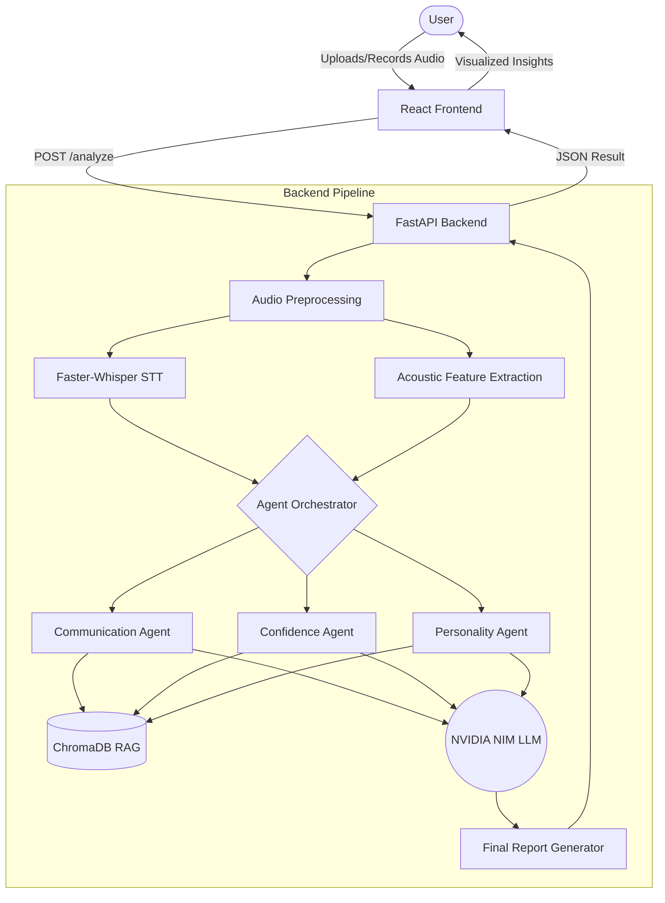

# TEAM-5 Speech Analysis Pipeline

[](https://www.python.org/downloads/)
[](https://fastapi.tiangolo.com/)
[](https://reactjs.org/)
[](https://www.docker.com/)
[](LICENSE)

An advanced AI-powered speech analysis system that provides real-time personality insights and communication feedback. Built with a robust multi-agent AI architecture powered by **NVIDIA NIM** LLMs and enhanced by Retrieval-Augmented Generation (RAG).

## 📋 Table of Contents

- [Overview](#overview)
- [Features](#features)
- [Architecture & Workflow](#architecture--workflow)
- [Prerequisites & System Requirements](#prerequisites--system-requirements)
- [Quick Start (Docker Compose)](#quick-start-docker-compose)
- [Manual Setup (Alternative)](#manual-setup-alternative)
- [Usage & API](#usage--api)
- [Project Structure](#project-structure)
- [Configuration](#configuration)
- [Testing & Quality Assessment](#testing--quality-assessment)
- [Troubleshooting](#troubleshooting)

---

## Overview

TEAM-5 provides a full-stack speech processing pipeline that combines state-of-the-art acoustic feature extraction with natural language understanding. By leveraging **NVIDIA's highly optimized AI endpoints**, the system parses speech patterns to deliver targeted, personalized communication feedback, confidence scoring, and personality traits using multi-agent insights.

---

## Features

### AI & Backend (Python/FastAPI)
- **Audio Processing:** Multi-format audio support with built-in recording capabilities.
- **Speech-to-Text:** Fast transcription utilizing Faster-Whisper.
- **Acoustic Feature Extraction:** Detailed analysis (pitch, energy, speaking rate, pauses) using openSMILE, Silero VAD, and librosa.
- **NVIDIA NIM Integration:** Utilizes `meta/llama3-8b-instruct` (configurable) via `langchain-nvidia-ai-endpoints` for ultra-fast, intelligent analysis.
- **Multi-Agent System:** Specialized agents for evaluating **Communication**, **Confidence**, and **Personality**.
- **RAG System:** ChromaDB-backed knowledge retrieval for domain-specific insights.

### Frontend (React/Vite)
- **Modern Stack:** React 19 + TypeScript + TailwindCSS.
- **Sleek UI:** Interactive progress tracking, file uploads, and responsive results visualization.

---

## Architecture & Workflow

The system is split into a React frontend and a FastAPI backend. The entire processing pipeline operates seamlessly to analyze user audio and generate actionable feedback.



---

## Prerequisites & System Requirements

Before starting, ensure you have the following installed:
- **Docker & Docker Compose** (Recommended for Quick Start)
- **NVIDIA API Key** (Required for LLM inference. Get one from [build.nvidia.com](https://build.nvidia.com/))
- **Node.js 18+** & **npm** (For manual frontend setup)
- **Python 3.8+** (For manual backend setup)

*Minimum System Specs:*
- **RAM:** 8GB (16GB recommended for local processing)
- **OS:** Linux, macOS, or Windows 10+
- **Microphone:** Required if using direct recording scripts.

---

## Quick Start (Docker Compose)

The easiest way to get the entire full-stack application running is via Docker Compose.

1. **Clone the repository:**
   ```bash
   git clone https://github.com/GSMPRANEETH/TEAM-5.git
   cd TEAM-5
   ```

2. **Set your NVIDIA API Key:**
   You can either export it in your shell or create an `.env` file in the root directory.
   ```bash
   export NVIDIA_API_KEY="nvapi-your-key-here"
   ```

3. **Build and Run the Containers:**
   ```bash
   docker-compose up --build
   ```

4. **Access the Application:**
   - **Frontend UI:** `http://localhost:5173`
   - **Backend API Docs:** `http://localhost:8000/docs`

---

## Manual Setup (Alternative)

If you prefer to run the services directly on your host machine without Docker:

### 1. Backend Setup

```bash
# Navigate to backend directory
cd backend

# Create and activate virtual environment
python -m venv .venv
source .venv/bin/activate  # On Windows: .venv\Scripts\activate

# Install dependencies
pip install -r requirements.txt

# Export your NVIDIA API Key
export NVIDIA_API_KEY="nvapi-your-key-here"  # Windows CMD: set NVIDIA_API_KEY="nvapi-..."

# Start the FastAPI server
uvicorn api:app --reload --port 8000
```

### 2. Frontend Setup

Open a new terminal session.

```bash
# Navigate to frontend directory
cd frontend

# Install dependencies
npm install

# Start the Vite development server
npm run dev
```
Access the frontend at `http://localhost:5173`.

---

## Usage & API

### Standalone CLI Pipeline

You can run the backend standalone script to preprocess and analyze an existing `raw_audio.wav` file from the terminal.

```bash
cd backend
python main.py
```
This script preprocesses `raw_audio.wav`, runs transcription + analysis + agents via NVIDIA NIM, and prints the complete report.

### REST API Usage

**Endpoint:** `POST /analyze`

Analyze an uploaded audio file using curl or Python:

```python
import requests

with open("sample_audio.wav", "rb") as f:
    response = requests.post(
        "http://localhost:8000/analyze",
        files={"file": f}
    )

print(response.json())
```

**Expected JSON Response:**
```json
{
  "transcript": "...",
  "audio_features": { ... },
  "communication_analysis": { ... },
  "confidence_emotion_analysis": { ... },
  "personality_analysis": { ... },
  "final_report": "..."
}
```

---

## Project Structure

```text
TEAM-5/
├── docker-compose.yml       # Full-stack Docker orchestration
├── backend/                 # FastAPI & AI Pipeline
│   ├── api.py               # Main API endpoints
│   ├── main.py              # CLI standalone pipeline script
│   ├── pipeline.py          # Transcription + speech-feature analysis helpers
│   ├── link.py              # API-facing orchestration (agents + RAG + final report)
│   ├── agents/              # Multi-agent system (Comm, Conf, Pers)
│   ├── llm/                 # NVIDIA LLM wrapper
│   ├── llm1/                # Prompts, config, and report generation
│   ├── rag/                 # RAG system & ChromaDB knowledge base
│   ├── evals/               # Evaluation framework
│   ├── requirements.txt     # Python dependencies
│   └── Dockerfile
└── frontend/                # React UI
    ├── src/                 # Application source code
    ├── package.json         # Node dependencies
    └── Dockerfile
```

---

## Configuration

You can customize the LLM behavior by modifying `backend/llm1/llm_config.py`:

```python
# Use available NVIDIA NIM models
LLM_MODEL_NAME = "meta/llama3-8b-instruct"
TEMPERATURE = 0.3
MAX_TOKENS = 512
```

RAG Configuration can be found in `backend/rag/config.py`:

```python
import os

CHROMA_PERSIST_DIR = os.path.join(os.path.dirname(__file__), "chroma_db")
TOP_K_RESULTS = 3
```

Current runtime behavior: `backend/rag/retriever.py` initializes `chromadb.Client()` for in-memory retrieval (no persistence directory used by default).

---

## Testing & Quality Assessment

Navigate to the `backend/` directory to run built-in test scripts:

- **Test LLM Connection:** Ensure your NVIDIA API Key is valid and reachable.
  ```bash
  python test_llm_step5.py
  ```

- **Test RAG Integration:** Validates ChromaDB knowledge retrieval.
  ```bash
  python test_rag.py
  ```

- **Code Formatting & Linting:**
  Run the Husky hooks manually or let them run on commit.
  ```bash
  ruff check .
  ```

---

## Troubleshooting

- **No NVIDIA API Key Found:**
  Ensure you have set the `NVIDIA_API_KEY` environment variable. If missing, the backend will gracefully fallback to a deterministic "Stub LLM" which generates mock JSON strings for testing purposes.

- **Missing Audio Dependencies:**
  If Faster-Whisper, PyAnnote, or Librosa fail to install or run, ensure you have system-level audio dependencies installed (like `ffmpeg` on Linux/macOS).

- **Docker Port Conflicts:**
  If you see "address already in use" errors, ensure ports `8000` (FastAPI) and `5173` (Vite) are not occupied.
  - **Linux/macOS:**
  ```bash
  kill -9 $(lsof -t -i:8000)
  ```
  - **Windows PowerShell:**
   ```powershell
   Get-NetTCPConnection -LocalPort 8000 | ForEach-Object { Stop-Process -Id $_.OwningProcess -Force }
   ```

- **Ruff Linting Paths Collision:**
  Ruff should be executed directly via `ruff check .` from inside the `backend` folder, not `python -m ruff`, to avoid pathing collisions with the internal `backend/types` module.

---

**Built with by TEAM-5**
